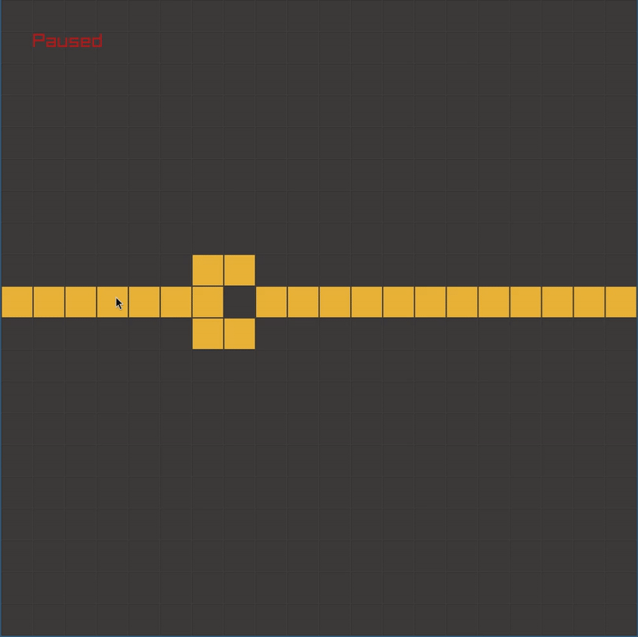
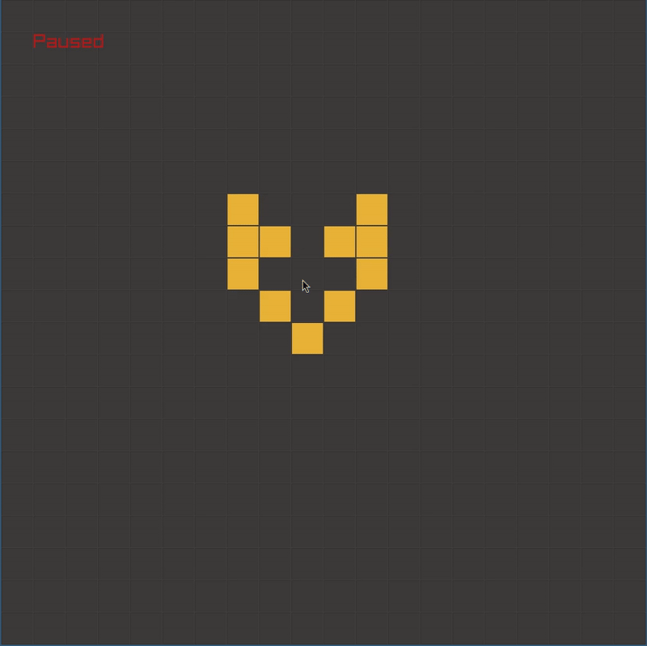

# Automata

Implementing various cellular automata algorithms including Conway's Game of Life, Wireworld, and Rule 110 using Raylib for visualization.

## Context
- [Conway's Game of Life](https://en.wikipedia.org/wiki/Conway%27s_Game_of_Life)
- [Wireworld](https://en.wikipedia.org/wiki/Wireworld)
- [Rule 110](https://en.wikipedia.org/wiki/Rule_110)
- [Smooth Life](https://arxiv.org/abs/1111.1567)

## Visuals



## Build & Run

```bash
# Build all visualizations
make

# Run specific visualization
./conway
./wireworld
./rule110
./smooth_life
```