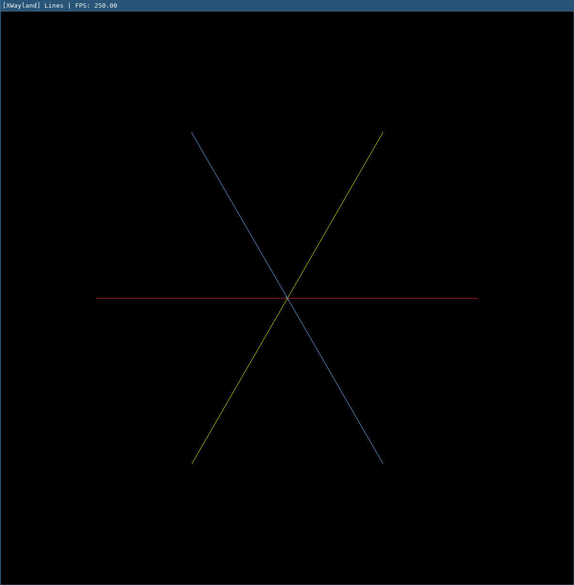

# Lines

Implementation of different line algorithms in C.

## Context
- [Bresenham's Line Algorithm - Wikipedia](https://en.wikipedia.org/wiki/Bresenham%27s_line_algorithm)
- [Gupta and Sproull algorithm - Wikipedia](https://en.wikipedia.org/wiki/Line_drawing_algorithm)



## Build & Run

```bash
# Build (requires SDL2)
make

# Run
./main
```
