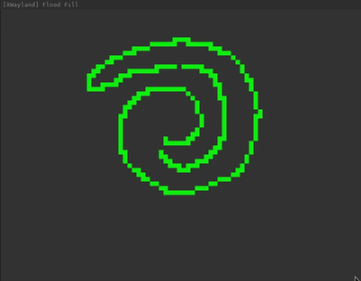

# Flood Fill
Implementing flood fill algorithm in LLVM IR using Raylib for visualization.

## Context
- [Flood Fill Algorithm](https://en.wikipedia.org/wiki/Flood_fill)
- [LLVM Language Reference](https://llvm.org/docs/LangRef.html)

## Visuals


## Build & Run

```bash
# Build
./build.sh

# Run
./main
```
