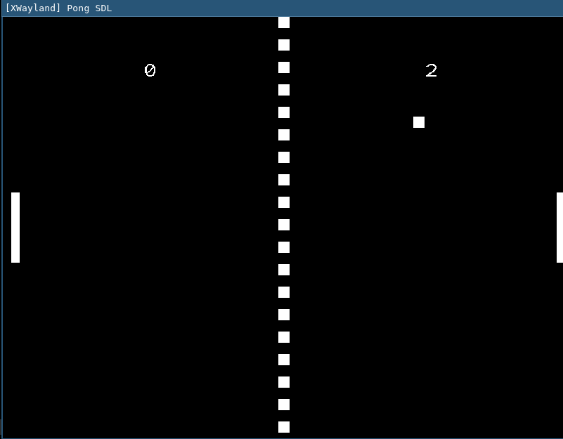
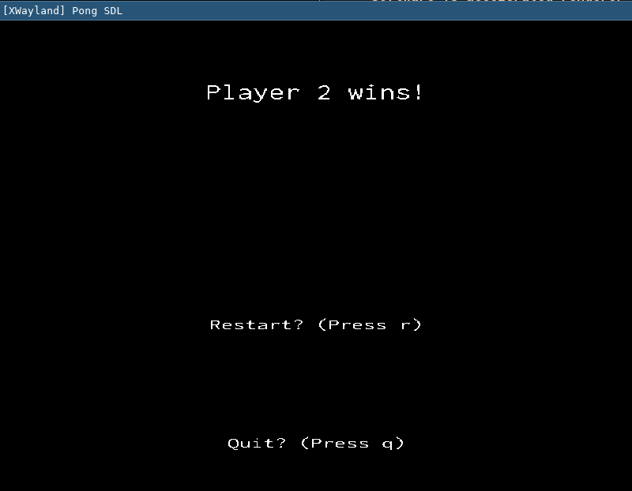

# Implementing Pong in Go+SDL

## Context
- [Wikipedia](https://en.wikipedia.org/wiki/Pong)

- Two files `main.go` with image buffer and blit to texture, `main2.go` with SDL drawing primitives.

## Visuals



## Build and Run
```bash
# Build & Run
go run main2.go
```
